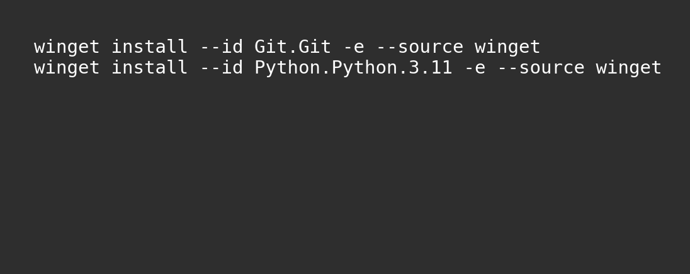

# ThreatMapper (Strict Embedding Mode)

This tool matches cybersecurity threats (from Microsoft Threat Modeling Tool exports) to existing cybersecurity requirements, **without external AI APIs**.  
It uses **local SentenceTransformer embeddings** + **Strict STRIDE rules**, so it runs in restricted corporate networks.

> **Assumption:** Team members have **Visual Studio Code (VS Code)** installed **from our Organization AppStore**. If not, please install it from the AppStore first.

---

## 1) Check & install prerequisites (in VS Code Terminal)


**Windows quick install via `winget` (inside VS Code Terminal):**




Open **VS Code → View → Terminal**, then check versions:
```bash
git --version
python --version
```

### If NOT installed, install directly from the VS Code terminal

#### Windows (recommended: **winget**, no admin typically required)
```powershell
# Install Git
winget install --id Git.Git -e

# Install Python 3.11 (or latest allowed)
winget install --id Python.Python.3.11 -e

# After install, restart VS Code terminal and verify:
git --version
python --version
```

> If `winget` is not available or blocked, use the Organization AppStore instead.

#### macOS (Homebrew)
```bash
# If Homebrew is installed:
brew install git
brew install python@3.11

# Verify:
git --version
python3 --version
```

#### Ubuntu/Debian (APT)
```bash
sudo apt-get update
sudo apt-get install -y git python3 python3-venv python3-pip
git --version
python3 --version
```

---

## 2) Clone the **correct branch** (not master)


```bash
git clone -b feature/assets-detection-and-ui https://github.com/AshwaSec21/ThreatMapper.git
cd ThreatMapper
```

This ensures you’re on **strict-embedding-mode + feature/assets-detection-and-ui** immediately.

---

## 3) Create & activate virtual environment


```bash
python -m venv .venv
. .venv\Scripts\Activate.ps1   # Windows PowerShell
```
If activation fails:
```powershell
Set-ExecutionPolicy -Scope CurrentUser -ExecutionPolicy RemoteSigned
. .venv\Scripts\Activate.ps1
```

---

## 4) Install & Run


```bash
pip install --upgrade pip
pip install -r requirements.txt

# If Torch install fails on Windows:
pip install torch torchvision torchaudio --index-url https://download.pytorch.org/whl/cpu
pip install -r requirements.txt

# Start the app:
streamlit run streamlit_app.py
```

The app opens at `http://localhost:8501`.

---

## Using the App

1. Upload **Requirements** (Excel) with columns:
   - `Requirement ID`
   - `Description`
   - `Assets Allocated to` *(optional but recommended)*
2. Upload **Threats** (Excel export from MS Threat Modeling Tool) with columns:
   - `Id`, `Title`, `Category`, `Interaction`, `Description`
3. Choose **Embedding-only (Strict STRIDE)** mode (LLM mode may be blocked by firewall).
4. Adjust **Similarity Threshold** and **α (category weight)** as needed.
5. Click **🚀 Run Matching** and download results as CSV.

---

## Offline Notes

- Embedding model loads from `models/all-MiniLM-L6-v2`.
- Runtime is offline (`HF_HUB_OFFLINE=1`, `TRANSFORMERS_OFFLINE=1`).
- If the model folder is missing, ask a teammate or pull latest from GitHub.

---

## Troubleshooting

- **No module named X** → Ensure venv is active and `pip install -r requirements.txt` completed without errors.
- **Torch install issues** → Use the CPU-only index shown above.
- **Port busy** → `streamlit run streamlit_app.py --server.port 8502`
- **LLM mode not working** → Expected in corporate network; use Embedding-only mode.

---

## Maintainer

**Ashwath Kumar** — Prototype focused on AVP/OSP; adaptable to other platforms.
